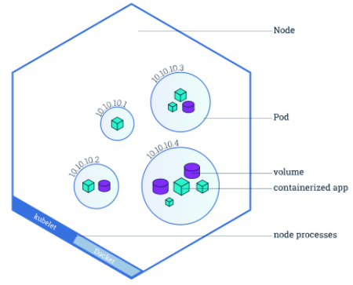
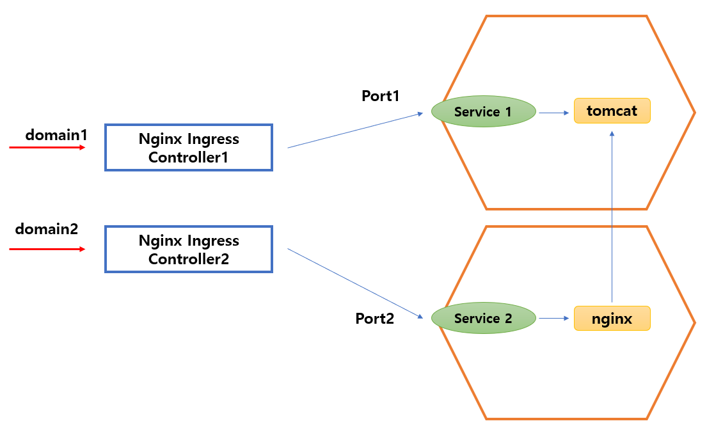

# kuberWorkspace

## 이론 설명
0. **Docker Window 환경에서 본 프로젝트를 진행**
    * Docker Window Download URL <br>
    ```https://docs.docker.com/desktop/windows/install/```
1. **Docker는 VM과 다르게 OPERATING SYSTEM을 공유하며 Image를 띄워 가볍게 환경을 구축 가능.**
2. **이 Image를 생성하는 방법은 Dockerfile을 작성 or 다른 사람이 만든 Image를 Full.**
    * 이 이미지가 모여있는 repository가 있음 <br>
    ```https://hub.docker.com/```
    *  docker image 검색 <br>
    ```docker image search imagename```
    *  docker image pull 명령 <br>
    ```docker pull options imagename:tag```
3. **Docker Image를 이용하여 Docker에 띄우면 Container라고 하고 이를 Kubernetes에서 관리하기 위해 Pod이라는 곳에서 Service와 함께 관리.**
    * Pod의 구조    
    

    * Pod을 yml로 생성할 수 있다.   
    <createPod.yml>
    ```yml
    apiVersion: v1 // 쿠버네티스 api의 버전 명세
    kind: Pod // 쿠버네티스 리소스 타입
    metadata: // metadata에서는 이름과 라벨 등 정의
        name: podName
        labels:
            app: appName
    spec: // 구체적인 사양을 정의하는 곳 : 1개의 pod에는 다수의 컨테이너를 탑재 가능
        containers:
            - name: containerName
              image: imageName (만약 tag가 있다면 imageName:tag)
              command: ['commandName']
    ```
    * 참조 URL <br>
    ```https://artist-developer.tistory.com/32```
    
4. **그래서 설계한 yml 파일을 kubernetes에서 적용하면 새로운 pod이 생성됨.**
    * 기존에 동일한 명으로 만들어져 있으면 에러 없으면 새로 생성 <br>
    ```kubectl create -f name.yml``` 
    * 기존에 만들어 져있으면 덮어씌우고 없으면 새로 생성 <br>
    ```kubectl apply -f name.yml```

## Kubernetes를 이용하여 설계
1. Kubernetes의 Ingress를 이용하여 외부에서 접근하는 도메인을 생성.
2. 생성한 도메인을 따라 각각 Kubernetes의 Service를 매칭시켜 나누어줌.
3. 각 POD에서 Container를 호출 할 때 (ex : nginx에서 tomcat으로 호출) 다음 양식을 갖춤.
    * 호출 url 양식 <br>
    ```http://serviceName.nameSpace.svc.cluster.local:servicePortNumber```
4. 본 프로젝트에서 설계한 Kubernetes의 구조
    

## Kubernetes Authorization을 통한 대쉬보드 이용 및 토큰 발급
1. Kubernetes는 기본적으로 Dashboard를 지원하지 않음.
    * 대쉬보드 생성 <br>
    ```kubectl apply -f https://raw.githubusercontent.com/kubernetes/dashboard/v2.4.0/aio/deploy/recommended.yaml```
2. 그래서 아래 명령어를 입력해주고 대쉬보드 url로 이동하면 들어가짐.
    * proxy 설정 <br>
    ```kubectl proxy```
    * 대쉬보드 URL <br>
    ```http://localhost:8001/api/v1/namespaces/kubernetes-dashboard/services/https:kubernetes-dashboard:/proxy/```
3. 대쉬보드를 들어가게 되면 토큰을 입력하게 되는데 토큰을 만들기 위해서는 권한을 설정해야함.
    * 권한을 설정하기 위해 작성할 파일 2개의 yml
    * 클러스터 롤 바인딩의 yml <br>
    <clusterRoleBinding.yml>
    ```yml
    apiVersion: rbac.authorization.k8s.io/v1
    kind: ClusterRoleBinding
    metadata:
    name: userName
    roleRef:
    apiGroup: rbac.authorization.k8s.io
    kind: ClusterRole
    name: clusterName
    subjects:
    - kind: ServiceAccount
        name: userName
        namespace: kubernetes-dashboard
    ```
    * 서비스 계정의 yml <br>
    <serviceAccount.yml>
    ```yml
    apiVersion: v1
    kind: ServiceAccount
    metadata:
    name: userName
    namespace: kubernetes-dashboard
    ```
    * yml을 작성하였으면 kubectl apply -f 명령어를 입력해주고 계정 토큰을 조회. <br>
    ```kubectl -n kubernetes-dashboard describe secret```
    
    * 리스트에서 userName을 찾고 token을 복사하여 Kubernetes 대쉬보드에 복사하면 접속 완료.
    
    